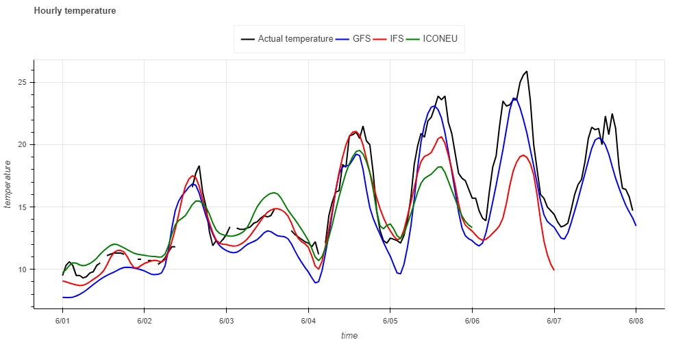
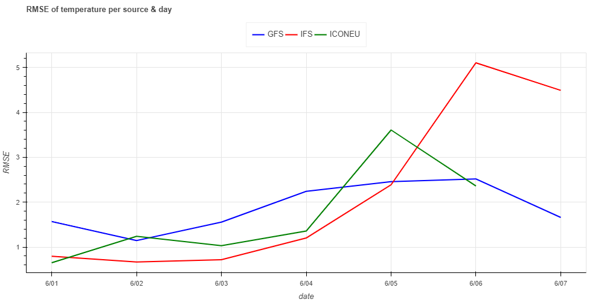
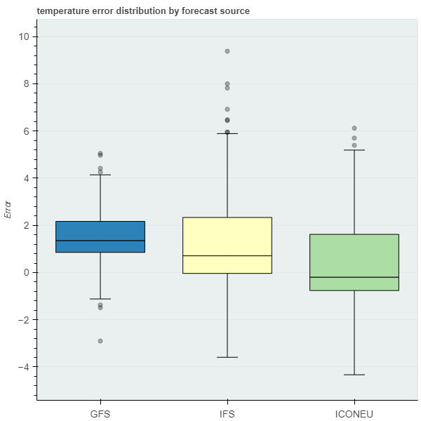

# Weather forecast evaluation results

### Error metrics used: RMSE and MAE
* **Temperature unit: degrees Celsius** 
* **Wind speed unit: m/s**
* **Wind direction unit: degrees**

### * Temperature

| Source   | GFS        | IFS      | ICONEU
| :------- |  :------:  |   ----:  |   ----:  
| RMS      |   1.977267 | 2.542639 | 1.976352
| MAE      |   1.659351 | 1.692443 | 1.423271

### * Wind speed

| Source   | GFS        | IFS      | ICONEU
| :------- |  :------:  |   ----:  |   ----:  
| RMS      |   1.857039 | 2.44719  | 1.49759
| MAE      |   1.486429 | 2.097675 | 1.28886

### * Wind direction

| Source   | GFS          | IFS        | ICONEU
| :------- |  :------:    |   ----:    |   ----:  
| RMS      |   121.346781 | 95.462597  | 99.181251
| MAE      |   81.473855  | 56.878499  | 58.0533

**As we can see from the tables above, for the total time period of measurements, the best models are:**
* temperature: ICONEU
* wind speed: ICONEU
* wind direction: IFS

**By plotting measured vs forecast temperature though we can see that the IFS and ICONEU models perform better on the first 4 days of the time period, but GFS performs similarly or better on the last 3 days, compared to the other models' forecasts, where available.**

**This can be even better observed by plotting RMSE per date.**

**Lastly, the box plot of temperature difference, calculated as actual - forecast, was created per model. Some of the things we can observe here is that the temperature difference range is smaller for the GFS model and that the IFS & ICONEU models have a wider interquartile range. GFS and IFS tend to predict a lower temperature than the actual, hence the mainly positive values of difference, while ICONEU is more close to a distribution around 0.**

